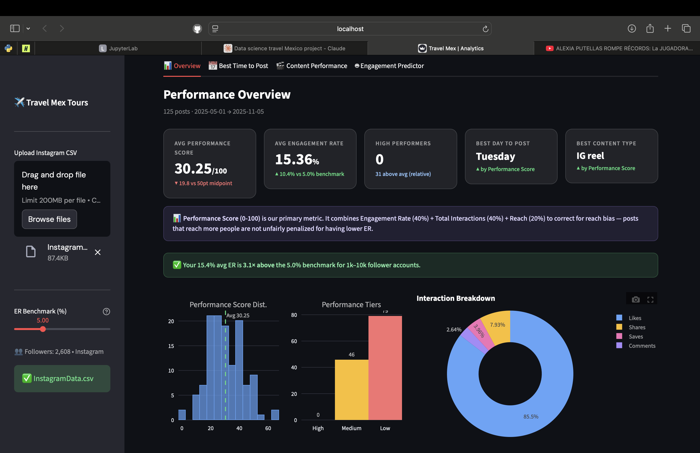
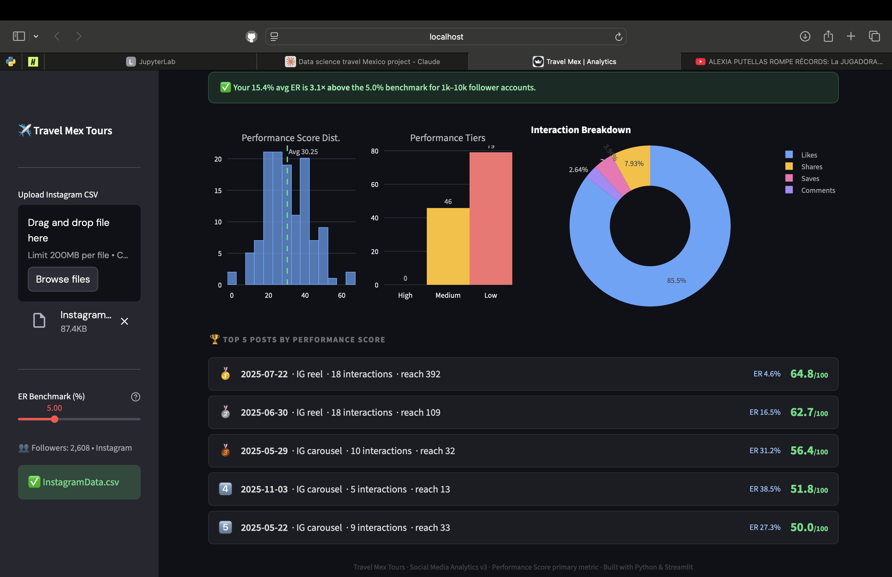
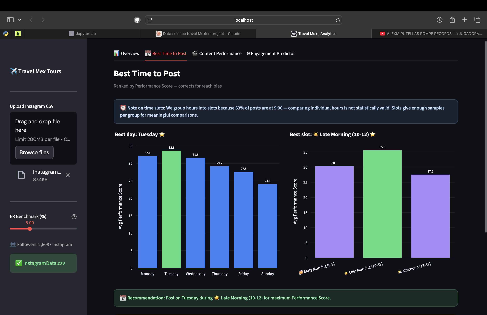
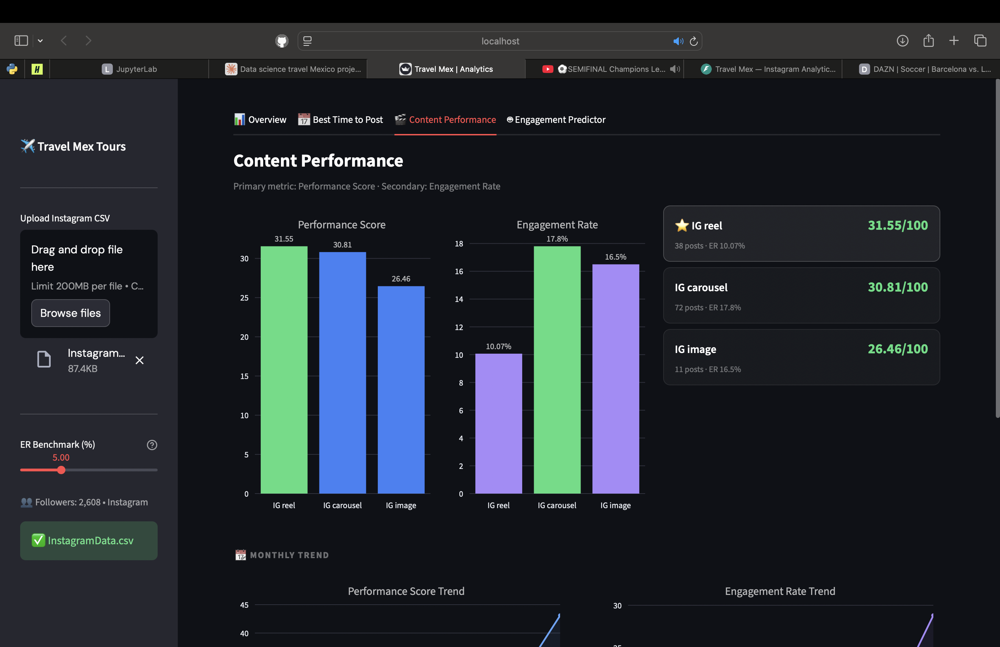
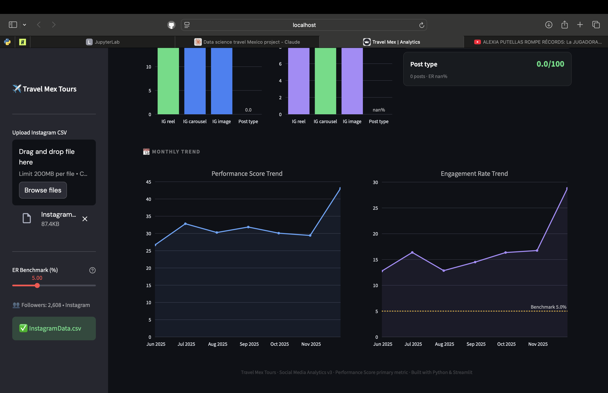
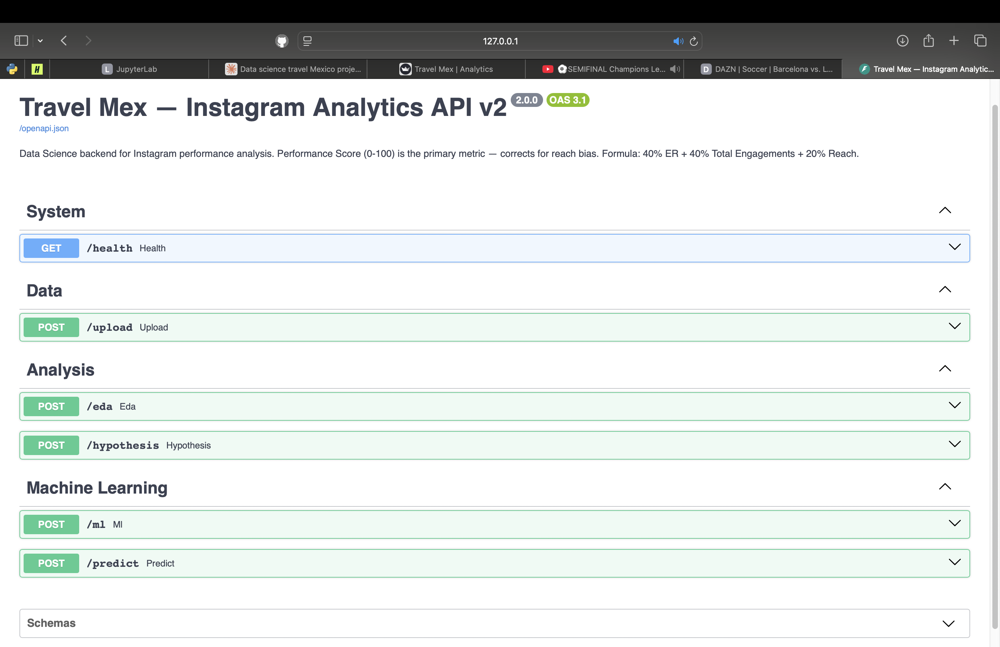
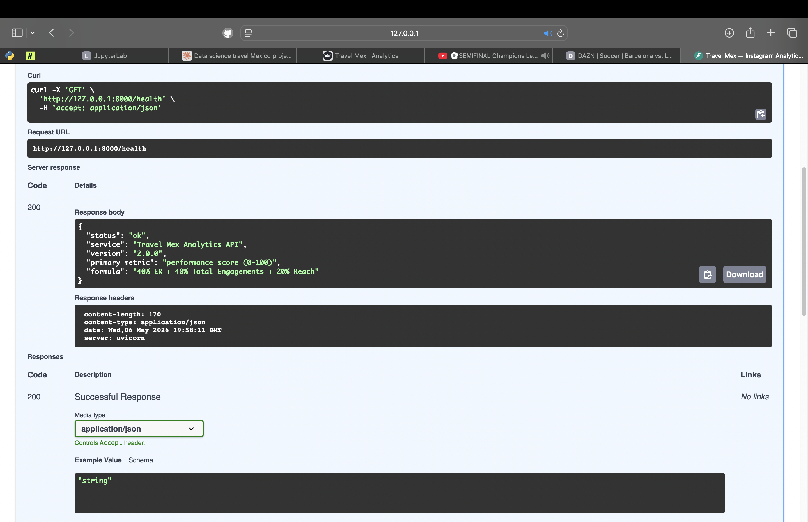
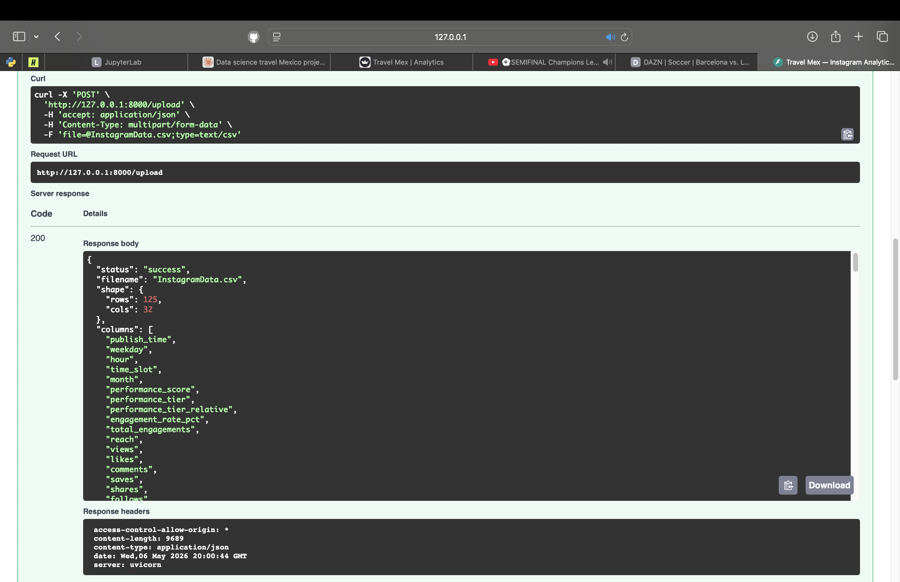

# 📊 Social Media Analytics — Travel Mex Tours


> **End-to-end Data Science project** analyzing Instagram performance for a Miami-based travel agency.  
> From raw CSV exports to machine learning predictions — with a custom **Performance Score** metric
> that corrects for reach bias in traditional Engagement Rate analysis.

---

## 🎯 Business Problem

Travel Mex Tours is a Miami-based travel agency with **2,608 Instagram followers** looking to grow
their social media presence and understand what content drives real impact.

The agency needed answers to four key questions:

1. **When** should they post to maximize engagement?
2. **What type of content** performs best?
3. Can we **predict performance before publishing** to optimize content strategy?
4. Are the differences we observe **statistically significant** or just random variation?

---

## 📊 Dashboard



*Performance Overview — KPI cards showing Performance Score, ER, best day and content type*



*Top 5 posts ranked by Performance Score — shows how reach bias is corrected (post #1 has ER 4.6% but Score 64.8 because it reached 392 people)*



*Best Time to Post — ranked by Performance Score using time slots instead of individual hours*



*Content Performance — Side-by-side comparison of Performance Score vs Engagement Rate per content type*



*Monthly trend — Performance Score and ER trending upward in late 2025*

---

## 🔑 Key Innovation — Performance Score

Traditional social media analytics uses **Engagement Rate (ER)** as the primary metric:

```
ER = Total Engagements / Reach × 100
```

**The problem:** A post reaching 30 people with 5 likes scores ER=16.7%.
A post reaching 300 people with 5 likes scores ER=1.7%.
The second post is penalized even though it reached 10× more people.

**Our solution — Performance Score (0-100):**

```
Performance Score = 0.4 × ER_normalized
                  + 0.4 × Total_Engagements_normalized
                  + 0.2 × Reach_normalized
```

Each component is min-max normalized to [0,1] using the account's own historical data.
A score of 100 means the post maximized all three dimensions simultaneously.

---

## 📈 Key Results

| Metric | Travel Mex | Benchmark (1k–10k accounts) |
|--------|-----------|------------------------------|
| Avg Engagement Rate | **15.4%** | 3–6% |
| Performance vs Benchmark | **3.1× above** ✅ | — |
| Avg Performance Score | **30.25 / 100** | — |
| Best Content Type | IG Reel (31.55/100) | — |
| Best Day to Post | Tuesday | — |
| Best Time Slot | Late Morning (10-12) | — |

---

## 🤖 Machine Learning Results

Two separate model sets trained:

**Full Model** (historical analysis — all features):

| Model | R² Score | MAE | CV R² |
|-------|----------|-----|-------|
| **Gradient Boosting** ⭐ | **0.9035** | **±2.91** | **0.8923** |
| Random Forest | 0.8812 | ±3.14 | 0.8701 |
| Ridge Regression | 0.7203 | ±4.21 | 0.7089 |
| Linear Regression | 0.6987 | ±4.38 | 0.6812 |

**Pre-Publication Predictor** (honest prediction — only features known before publishing):

| Target | CV R² | Features Used |
|--------|-------|---------------|
| Performance Score | **0.757 ± 0.088** | reach, views, likes, content type, day, time slot, month |
| Engagement Rate | **0.726 ± 0.122** | same |

> The predictor's lower R² is **expected and correct** — we predict with pre-publication data only.
> No data leakage.

**Top driver of Performance Score: `reach`** (48.5% importance)

---

## 🧪 Hypothesis Testing Results

Three statistical tests run at α = 0.05:

| Test | Metric | Result | Effect |
|------|--------|--------|--------|
| ANOVA — Content Type | Performance Score | Significant ✅ | Medium |
| ANOVA — Time Slot | Performance Score | Not significant ❌ | Small |
| t-test — Weekend vs Weekday | Performance Score | Insufficient data ⚠️ | — |

> Weekend test requires ≥5 weekend posts. Currently 1. Experiment recommended.

---

## 🌐 FastAPI Backend



*FastAPI v2.0.0 — 6 endpoints with Performance Score as primary metric*



*GET /health — documents primary metric and formula*



*POST /upload — returns performance_score, performance_tier and time_slot columns*

---

## 📁 Project Structure

```
social-media-analytics-travelmex/
│
├── notebooks/
│   └── instagram/
│       ├── 01_EDA.ipynb
│       ├── 02_Hypothesis_Testing.ipynb
│       ├── 03_Machine_Learning.ipynb
│       └── 04_Content_Strategy.ipynb
│
├── src/
│   ├── load_data.py
│   ├── preprocessing.py
│   ├── eda.py
│   ├── hypothesis_testing.py
│   ├── machine_learning.py
│   └── app.py
│
├── backend/
│   └── main.py
│
├── assets/
├── data/instagram/
├── outputs/figures/
├── requirements.txt
└── README.md
```

---

## 🛠️ Tech Stack

| Category | Tools |
|----------|-------|
| Data manipulation | Pandas, NumPy |
| Statistics | SciPy |
| Machine Learning | Scikit-learn (Gradient Boosting, Random Forest, Ridge, Linear) |
| Visualization | Plotly, Matplotlib, Seaborn |
| Dashboard | Streamlit |
| Backend API | FastAPI + Uvicorn |
| Notebooks | Jupyter Lab |
| Version Control | Git + GitHub (Git Flow) |

---

## 🚀 Getting Started

```bash
git clone https://github.com/mariagarciasehara/social-media-analytics-travelmex.git
cd social-media-analytics-travelmex
pip install -r requirements.txt
```

Add your Instagram CSV to `data/instagram/` — notebooks auto-detect the most recent file.

```bash
# Streamlit dashboard
streamlit run src/app.py

# FastAPI backend
uvicorn backend.main:app --reload --port 8000
# Docs at http://127.0.0.1:8000/docs
```

---

## 📊 Notebooks Overview

### 01 — EDA
Performance Score distribution, reach bias demonstration, best day/time slot, content type comparison, monthly trend.

### 02 — Hypothesis Testing
ANOVA for content type and time slot. Weekend vs weekday auto-activates when ≥5 weekend posts available. Effect size (η²) for all tests.

### 03 — Machine Learning
Full model (4 algorithms, 5-fold CV) + pre-publication predictor with no data leakage. Feature importance for both Score and ER. Sensitivity analysis.

### 04 — Content Strategy
K-Means clustering, Save Rate vs Share Rate, destination analysis (min 10 posts), caption analysis, recommended experiments.

---

## 🗺️ Roadmap

- [x] Instagram EDA with Performance Score
- [x] Hypothesis Testing
- [x] Machine Learning — Full + Pre-publication predictor
- [x] Content Strategy Analysis
- [x] Streamlit Dashboard v3
- [x] FastAPI Backend v2
- [x] Git Flow with feature branches and PRs
- [ ] Weekend analysis (needs more weekend posts)
- [ ] Facebook Analysis
- [ ] TikTok Analysis
- [ ] YouTube Analysis
- [ ] Multi-platform comparison dashboard

---

## 👩‍💻 Author

**Maria Garcia Sehara**  
Data Analyst | Miami, FL  
[GitHub](https://github.com/mariagarciasehara)

---

## 📄 License

Educational and portfolio purposes. Data belongs to Travel Mex Tours and is not included in this repository.
